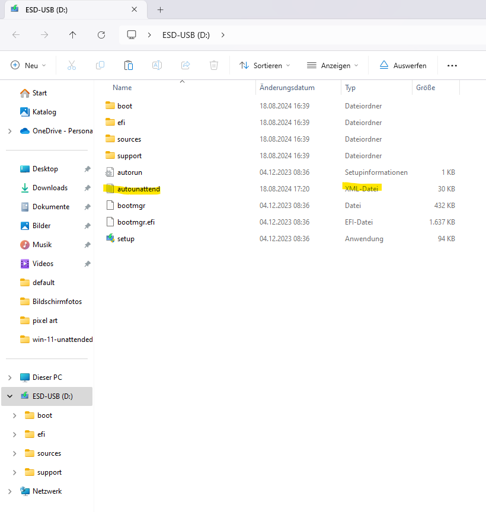

# 🏄 Win-11-unattended
Create config files for unattended Windows 11 Home installations.

## 🧾 Sources
YouTube:
* https://www.youtube.com/watch?v=JUTdRZNqODY

Web:
* https://www.microsoft.com/de-de/software-download/windows11
* https://schneegans.de/windows/unattend-generator/

# 💡 How to
A generic template for the autounattend.xml file was generated with the help of [schneegans.de](https://schneegans.de/windows/unattend-generator/) and checked in as [autounattend_template.xml](autounattend_template.xml).

Some values in the template are provided as placeholders. To use the template, create a file named ``autounattend.xml``, copy the templates content into it and replace all placeholders with the actual value you want to use for the Windows 11 installation.

Next, copy the ``autounattend.xml`` file inside the root folder of your windows installation media drive and you are ready to go (see image_1).

| Placeholder            | Purpose                                      |
| ---------------------- | -------------------------------------------- |
| PhAdminAccountName     | Initial admin account to create.             |
| PhAdminAccountPassword | Password for the initial admin account.      |
| PhWifiSid              | Wifi SID to connect to.                      |
| PhWifiPassword         | Password for the Wifi to connect to.         |



## 📖 Versioning
Versioning is done by creating annotated git tags (https://git-scm.com/book/en/v2/Git-Basics-Tagging).

```bash
# list existing tags
git tag

# create a new annotated tag
git tag -a "vX.Y.Z" -m "Message"

# delete a local tag
git tag -d <tagname>

# delete a tag from remote
git push origin --delete <tagname>

# push tags to remote
git push origin --tags
```
